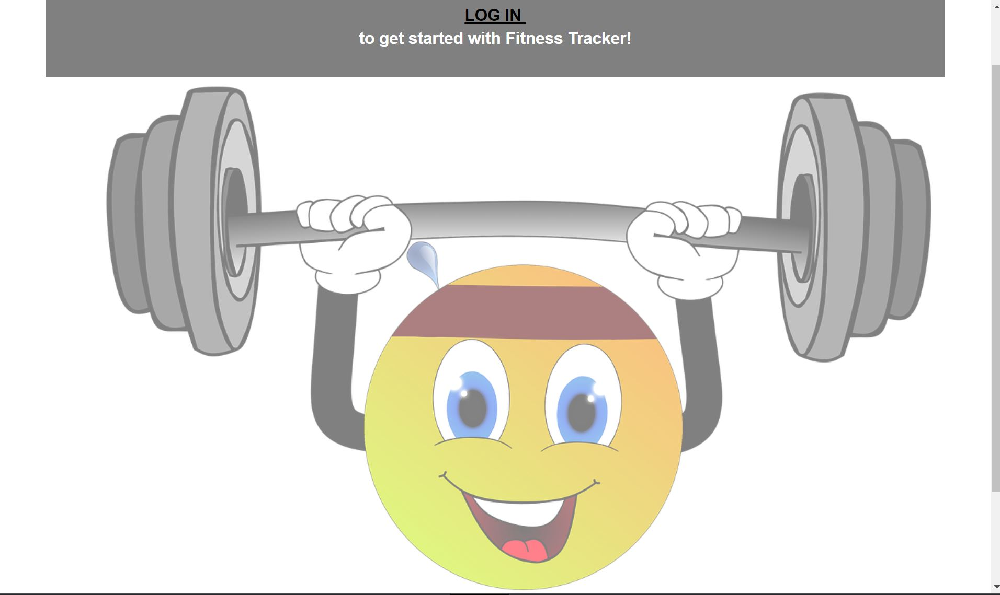
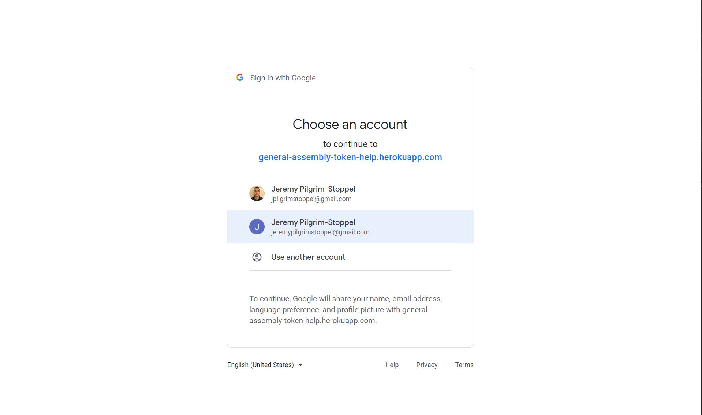
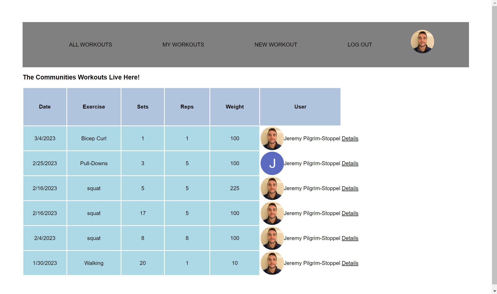
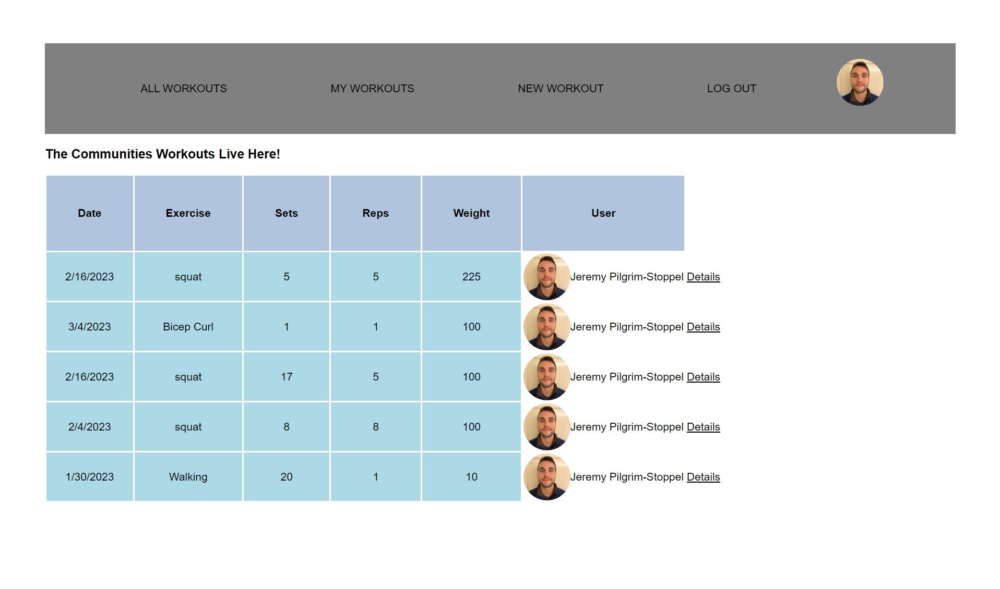
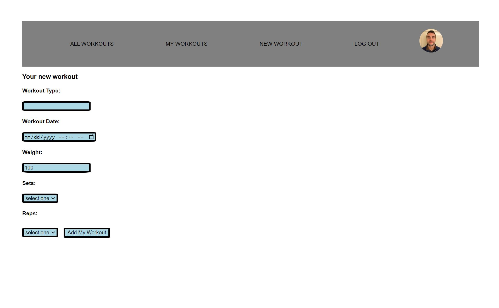
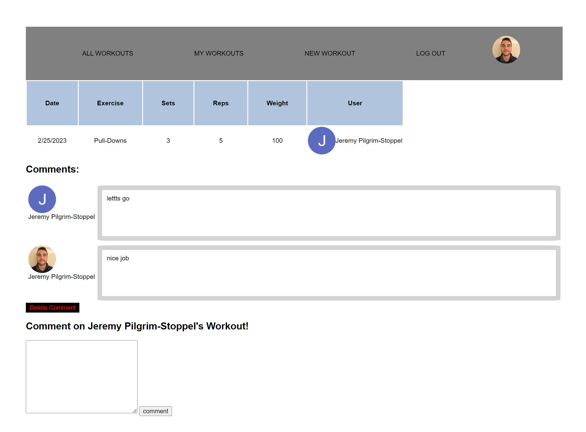
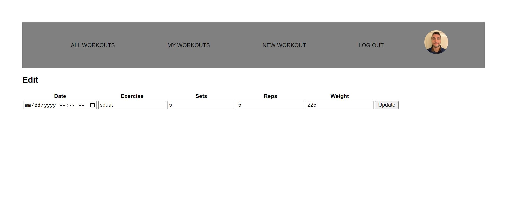

# Your Fitness Tracker

This app helps users track their workouts over time so they can visualize their progress and take control of their fitness!

# Screenshot

# Technologies Used

- JavaScript
- HTML
- CSS
- Node
- MongoDB
- Mongoose
- Express

# Getting Started

[Click to View Project Planning](https://trello.com/b/ZTPaf6M4/project-2)

[Click to get Fit!](https://general-assembly-token-help.herokuapp.com/)

# Next Steps

- Add functionality of liking/disliking posts & comments
- Allow users to enter overall health and wellness data, like sleep, nurtition, and recovery details